# Fudie - Discover, Plan & Cook

A meal recipe application to provide meals, their ingredients and cooking instructions. Some meals have video links from where you can stream the 
cooking procedure in youtube.


Fudie is an android application built in Kotlin using Jetpack Compose. The app provides users with a wide range of recipes, ingredients and 
cooking instructions. The app also features video links for some of the meals, which can be streamed directly from YouTube. 
The app allows users to create meal plans, making it easier to plan their weekly meals.

<a href='https://play.google.com/store/apps/details?id=com.fudie.core'></a>

## Screenshots & Demo

### Light Theme

Home Screen           |                  Categories Screen                   |                 Planner  Screen                  |
:-------------------------:|:----------------------------------------------------:|:------------------------------------------------:|
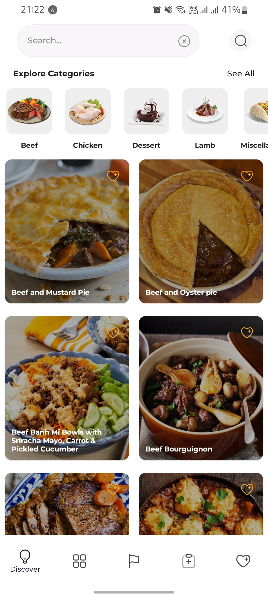  | 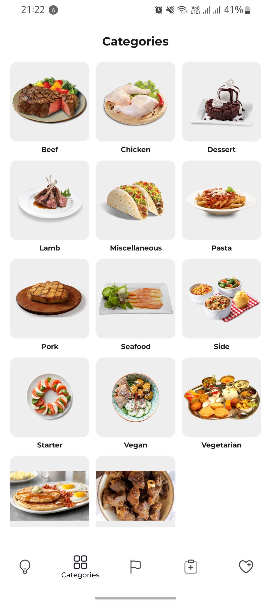 | 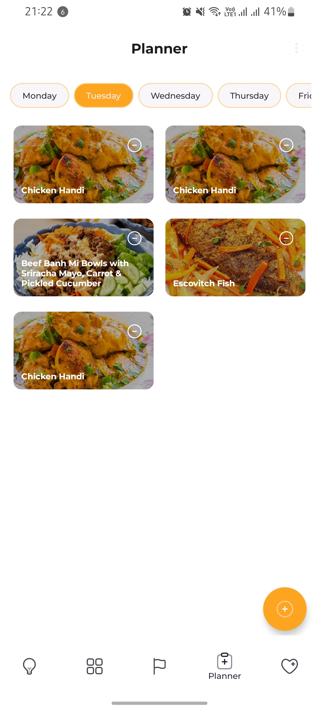 | 
Cuisine  screen          |                    Recipe Details                    |                Favourites Screens                |
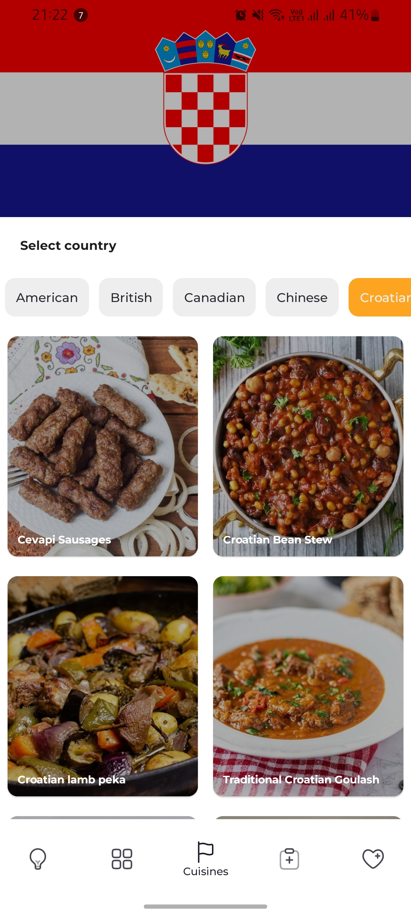  |  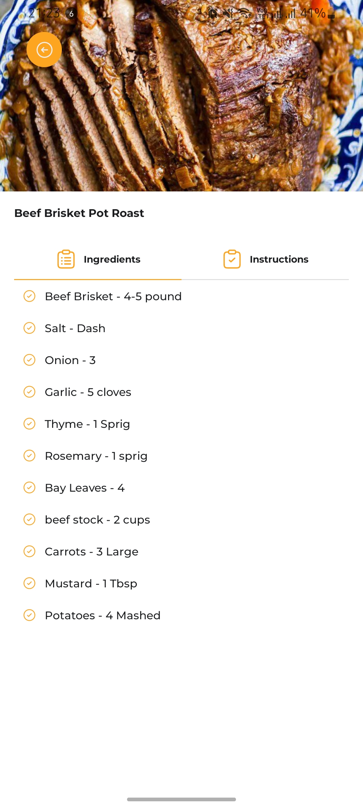  | 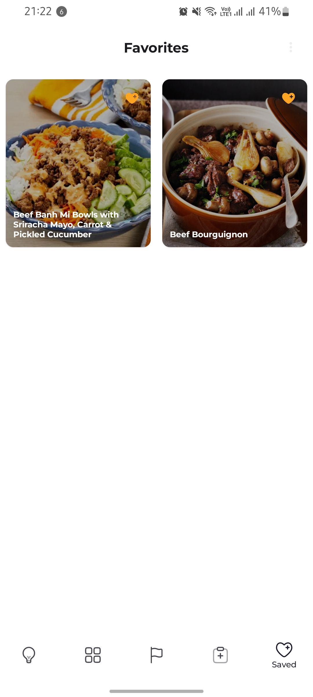 | 

### Dark Theme
Home Screen              |                 Categories Screen                 |                   Planner  Screen                   |
:-------------------------:|:-------------------------------------------------:|:---------------------------------------------------:|
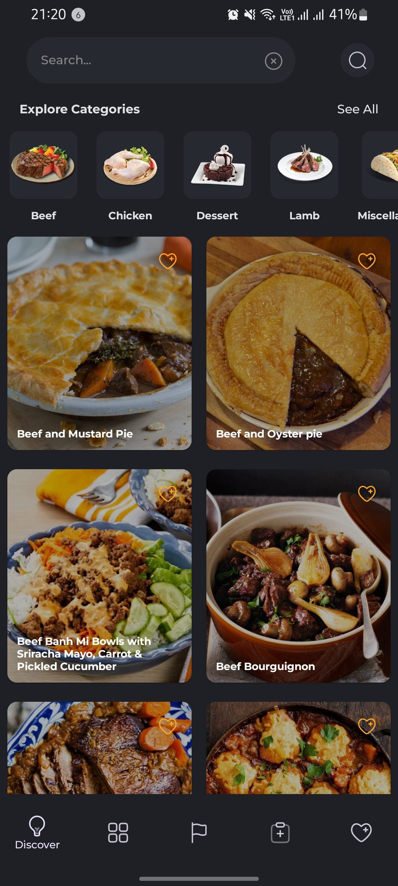  | 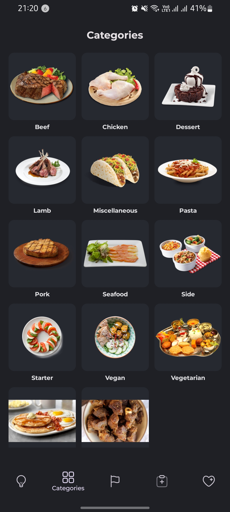 |   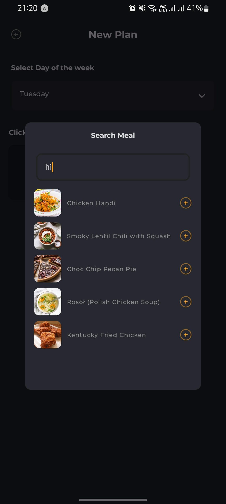    | 
Cuisine  screen        |                  Recipe Details                   |                 Favourites Screens                  |
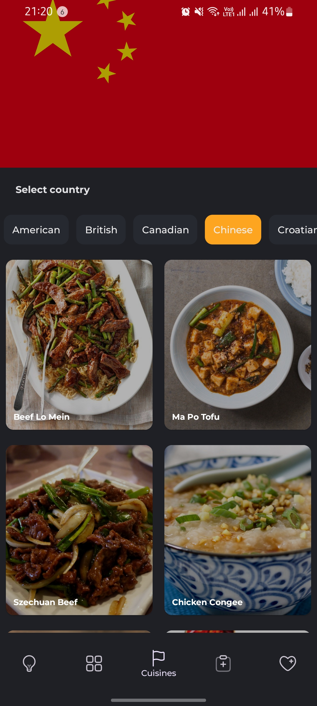  |   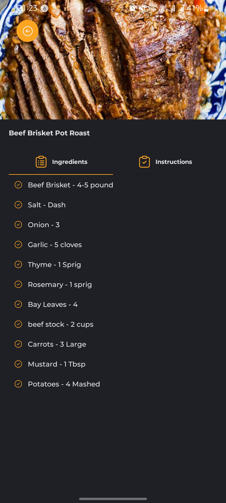   | 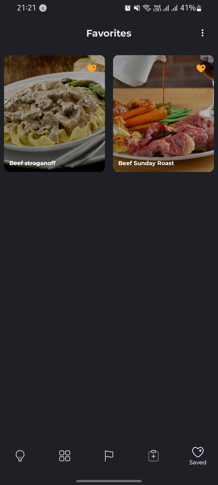 | 


## Tools and Libraries Used

The following tools and libraries were used in building Fudie:
 - [Kotlin](https://kotlinlang.org/). Kotlin is a programming language that running on JVM with immense support from google and the entire tech community.
    - [Jetpack Compose](https://developer.android.com/jetpack/compose) - Android’s modern toolkit for building native UI.
- [Retrofit](https://github.com/square/retrofit) - Retrofit is a popular HTTP client used for making network calls in android. It is used in Fudie to fetch data from an external API.
- [Dagger Hilt](https://dagger.dev/hilt/) - Dagger Hilt is a dependency injection framework for android. It is used in Fudie to manage dependencies and provide 
a cleaner architecture.
- [View Models](https://developer.android.com/topic/libraries/architecture/viewmodel) - View Models are used in Fudie to manage the app's UI related data. They provide a way for the app to survive configuration changes, 
such as screen rotations.
- [Room Database](https://developer.android.com/training/data-storage/room) - Room Database is a persistence library used for storing data locally. It is used in Fudie to store recipes and meal plans.
- GSON - JSON Parser,used to parse requests on the data layer for Entities and understands Kotlin non-nullable and default parameters.
- Kotlin Flow - In coroutines, a flow is a type that can emit multiple values sequentially, as opposed to suspend functions that return only a single value.

## Overall Architecture

Fudie follows the Model-View-ViewModel (MVVM) architecture pattern. The model layer is responsible for fetching and storing data. 
The view layer is responsible for displaying the UI to the user. The ViewModel layer acts as the mediator between the view and model layers, 
managing the data flow and interactions.

 - [MVVM](https://developer.android.com/jetpack/guide?gclid=CjwKCAiAvaGRBhBlEiwAiY-yMLJgFw8dtzM8r78wKMlnykKhTDwh5vx4ZOGqGBbXQ8PEFlYsS_b_oBoCRGoQAvD_BwE&gclsrc=aw.ds)
        - Makes it easier to write modular, reusable and easy to test code
 - [Android Architecture components](https://developer.android.com/topic/libraries/architecture). An app architecture defines the boundaries between parts of the app and the responsibilities each part should have.
 - [ViewModel](https://developer.android.com/topic/libraries/architecture/viewmodel)

## Fudie Modules
The application is divided into three main modules to help manage and organize its functionalities. The modules include the core module, d
ata models module, and domain module.

### Core Module
The core module is responsible for the application's user interface and all the UI-related functionalities. It includes composables which help define 
the application's user interface. The core module uses Jetpack Compose, a modern UI toolkit that simplifies UI development and makes it more efficient.

The core module is responsible for handling user input, displaying information to the user, and handling user interactions. It is the primary module 
that interacts with the user and is the main entry point for the application.

### Data  Module
The data  module is responsible for fetching data from the remote API and saving it to the local room database. It includes classes such as data sources, 
repositories, and entities that help define the data structure and access.

The data sources classes are responsible for fetching data from the remote API using Retrofit. The repositories are responsible for combining data 
from different sources and providing them to the domain module. The entities are the data models that are stored in the local room database.

The data models module ensures that the data is available when needed, whether online or offline, by providing a centralized interface to access the data. 
This module makes it easy to modify data sources, migrate data, and provides data consistency and accuracy.

### Domain Module
The domain module is responsible for the application's business logic. It includes classes such as use cases, domain entities, and mappers. 
The use cases are the building blocks of the application's functionality, and they define what the application can do.

The domain entities represent the data model that the application uses, and they encapsulate the business logic of the application. 
The mappers are responsible for mapping the data models between the data models module and the domain module.

The domain module interacts with the data models module to retrieve the data and then prepares it for presentation in the core module. 
It ensures that the data is well organized, easy to manipulate, and ready for use by the application's user interface.


## Getting Started

To clone the Fudie project and run it on your local machine, follow these steps:

- Open your command line interface and navigate to the directory where you want to store the project.
- Type git clone https://github.com/jerimkaura/fudie.git and press Enter. This will download the project files to your local machine.
- Open Android Studio and click on "Open an existing Android Studio project" from the welcome screen. 
  Navigate to the directory where you cloned the project and select it.
- Wait for Android Studio to build the project and download any dependencies. This may take a few minutes.
- Once the project is built, you can run it on an emulator or a physical device. To run the project, click on the green arrow in the toolbar at the top of the screen or select "Run" from the "Run" menu.

Note: Before running the project, make sure to check if you have the required tools and libraries installed, such as the Android SDK, Gradle, and any other dependencies specified in the project's build.gradle files. You may need to update these tools and libraries to their latest versions to avoid any compatibility issues.

## Support
If you find this project useful, please leave a star ⭐️  on the top right, create an issue in the [issue section](https://github.com/jerimkaura/fudieissues)
or launch a [pull request here](https://github.com/jerimkaura/fudie/pulls). Feel free to contribute to this project in any way but if you have time, review my code, *correct my mess*
and let us work together. You feedback will be highly appreciated.

## License

 ```
 MIT License
 
 Copyright (c) 2022 Jerim Kaura
 
 Permission is hereby granted, free of charge, to any person obtaining a copy of this software and 
 associated documentation files (the "Software"), to deal in the Software without restriction, including 
 without limitation the rights to use, copy, modify, merge, publish, distribute, sublicense, and/or sell 
 copies of the Software, and to permit persons to whom the Software is furnished to do so, subject to 
 the following conditions:
 
 The above copyright notice and this permission notice shall be included in all copies or substantial 
 portions of the Software.
 
 THE SOFTWARE IS PROVIDED "AS IS", WITHOUT WARRANTY OF ANY KIND, EXPRESS OR IMPLIED, INCLUDING BUT NOT 
 LIMITED TO THE WARRANTIES OF MERCHANTABILITY, FITNESS FOR A PARTICULAR PURPOSE AND NONINFRINGEMENT. IN 
 NO EVENT SHALL THE AUTHORS OR COPYRIGHT HOLDERS BE LIABLE FOR ANY CLAIM, DAMAGES OR OTHER LIABILITY, 
 WHETHER IN AN ACTION OF  TORT OR OTHERWISE, ARISING FROM, OUT OF OR IN CONNECTION WITH THE 
 SOFTWARE OR THE USE OR OTHER DEALINGS IN THE SOFTWARE.
 ```
